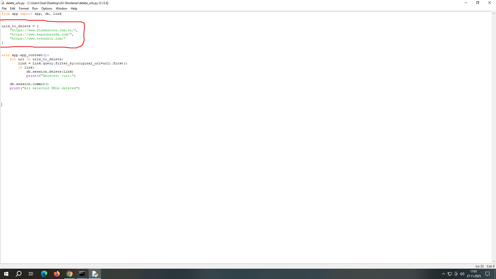

# DATABASE.DB

database.db is the main SQLite-based database that stores all the data of our URL shortener application. This file is automatically created within the project's instance/ folder and is managed by the backend.

This database is responsible for storing all the shortened links, their click counts, and detailed click logs generated by the system.

  

Database Purpose

This file ensures that all operations performed in the application are persistently stored:

 

1. Stores Shortened Links

The data from the Link model in the backend is saved into database.db:

original_url → The long URL entered by the user

short_url → The 6-character short code generated by the system

clicks → Total number of clicks

Whenever a new URL is added to the system, this information is saved in database.db.

  

2. Stores Click Details

Thanks to the ClickDetail table, every click is logged individually:

IP address

Browser information (User-Agent)

Timestamp of the click

Which short link was clicked

This allows the admin panel to display both total clicks and detailed logs.

  

3. Loads All Analytics in the Admin Panel

The GET /api/analytics request via JQuery fetches the data directly from database.db.

Without this file:

The table would not load

Clicks would not be visible

The list of shortened links would be empty

So, the functioning of the admin panel entirely depends on this database file.

  

4. delete_urls.py Script Deletes from This File

When delete_urls.py is executed:

It searches for the addresses listed in urls_to_delete inside database.db

If a record exists, it is deleted from the database

This effectively removes the link from the admin panel

This operation is performed directly on the database without requiring backend or frontend intervention.

  

In Short:

database.db is the brain of the system.

All links, clicks, logs, and admin panel statistics are stored here.
Every time the project runs, the backend connects to this file to read and update the data.

   

# URL SHORTENER

The purpose of my URL Shortener project is to allow users to easily convert long and complex web links — for example, 15 or 20 characters long with numbers, and even longer — into short, shareable, and copyable links.

After entering the URL into the “Enter your URL” field and clicking the Shorten button the system generates a 6-character short code and appends it to the original link end.

Then it moves to the Short-URL section and when the code is clicked the user is redirected to the main or related target site.

Each time a short link is clicked the click count automatically increases by +1, the bar chart updates, and the user is redirected to the original website.

Additionally, all links are displayed in the analytics table in real time allowing the user to easily copy them or open them in a new tab, new window, or incognito window.

  

# COPY & REDIRECT LOGIC

On the Click Analytics page when you generate a short link for a website such as https://www.instagram.com/

the system creates a 6‑character short code (example: ZoCZdZ).

When the user clicks the Copy button the platform produces a short URL like: http://127.0.0.1:5000/ZoCZdZ

Although this URL may look like it belongs to Instagram or another target website it actually belongs to the URL Shortener platform itself.

Here:

http://127.0.0.1:5000/ → Mine the domain of the URL Shortener application

ZoCZdZ → the 6‑character code generated for Instagram’s original long link

When the user clicks the short link they are automatically redirected to the original destination whether it is Instagram’s homepage or any other subpage.

This redirect mechanism works the same for all websites:

1- The platform receives a long URL,

2- Generates a unique 6‑character code,

3- Appends this code to its own domain,

4- Redirects the user to the real target URL.

This makes long and complex links much shorter, shareable, and easier to track through the analytics table.

  

# SHORT-URL WORK FLOW 

After clicking the 6‑character code in the Short-URL section the user is redirected to the main or sub page of Instagram (or any other website) based on the generated 6‑character code.

  

# TOTAL CLICKS WORK FLOW

After clicking the system through the combined operation of the jQuery frontend and backend functions increments the click count by +1. This updated value is immediately reflected in the total clicks. 

If desired the short link can also be opened in a new tab, new window, or incognito window and the functions will work in all cases gives the +1 values.

  

# REMOVE ORIGINAL URL WORKFLOW

In the admin panel you can optionally select and remove any shortened website from the original URL list whether by its long URL or its six-character short code.

This operation is performed using our delete_urls.py file. By adding the desired websites to the urls_to_delete list the selected URLs will be removed from the panel.

  

# REMOVE WITH CMD COMMAND

And afterward to execute the removal process you need to run specific commands in the Windows CMD so that the system can detect the unwanted websites in the admin panel.

First to access our project I type: cd Desktop/Url-Shortener 

and then to perform the deletion I run: python delete_urls.py

Which makes the system detect and remove the unwanted websites listed.

  

# RE-BACK DASHBOARD

And as shown by performing the necessary actions in the admin panel we have removed the websites https://www.flashscore.com.tr/, https://www.hepsiburada.com/ and https://www.trendyol.com/ from our system.

    

